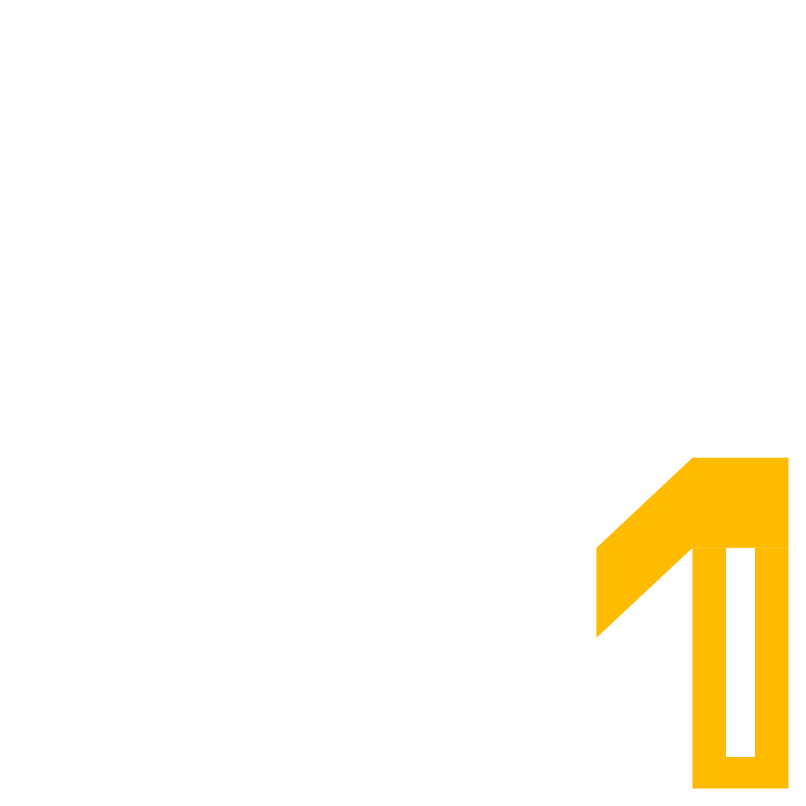
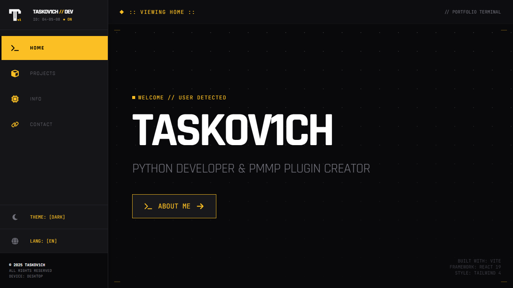
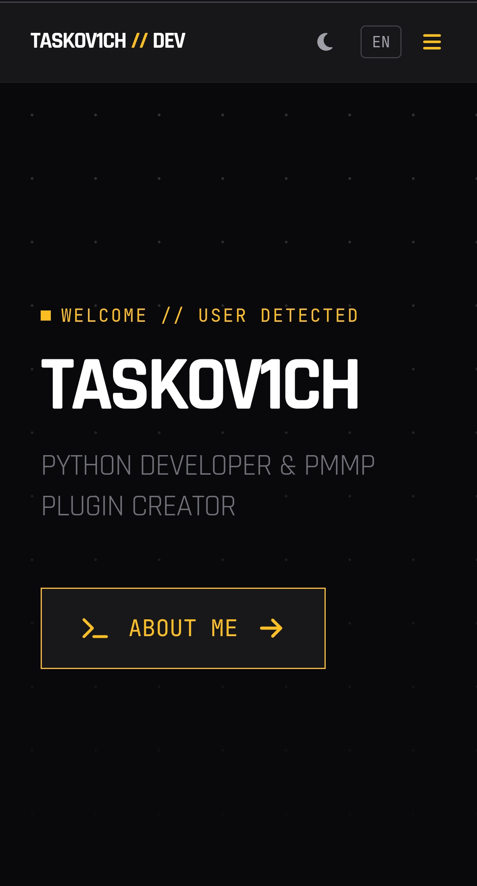

<div align="center">
  
  <h1>TASKOV1CH // WEBSITE</h1>
  <p>
    <strong>Industrial Futurism Portfolio Interface</strong>
    <br />
    Inspired by <em><a href="https://endfield.gryphline.com/">Arknights: Endfield</a></em> & <a href="https://www.cyberpunk.net/">Cyberpunk 2077</a> aesthetics.
  </p>

  <p>
    <a href="https://react.dev/">
      
    </a>
    <a href="https://vitejs.dev/">
      
    </a>
    <a href="https://tailwindcss.com/">
      
    </a>
  </p>
</div>

---

## ⚡ About the Project

**Taskov1ch Website** is a web portfolio in an industrial futurism/cyberpunk style, inspired by the aesthetics of **Arknights: Endfield** and **Cyberpunk 2077**.
The project simulates a cyber-terminal interface with a focus on utility, readability, and animated navigation.

### ✨ Key Features

- **🎨 Custom Design System:** Tailwind CSS v4 with an extended variable system and a custom theme.
- **📱 Responsive Interface:**
  - **Desktop:** Two-panel layout with content preview.
  - **Mobile:** Modal windows, simplified navigation, optimized for touch.
- **🌍 i18n Localization:**
  - Support for **EN** and **RU**, autodetection + localStorage persistence.
- **🐙 GitHub Integration:**
  - Fetches `README.md` from repositories in real time.
- **🔄 Animations:**
  - Page transitions and micro-interactions powered by **Framer Motion**.

---

## 🛠 Tech Stack

| Category | Technologies |
| --- | --- |
| **Core** | React 19, TypeScript |
| **Build Tool** | Vite |
| **Styling** | Tailwind CSS v4 |
| **Router** | React Router DOM |
| **Animation** | Framer Motion |
| **Icons** | React Icons |
| **i18n** | i18next, react-i18next |
| **Markdown** | react-markdown, remark-gfm |

---

## 🚀 Run Locally

1. **Clone the repository:**

   ```bash
   git clone https://github.com/taskov1ch-repos/taskov1ch-website.git
   cd taskov1ch-website
   ```

2. **Install dependencies:**

   ```bash
   npm install
   ```

3. **Start the dev server:**

   ```bash
   npm run dev
   ```

4. Open in your browser:

   **[http://localhost:5173](http://localhost:5173)**

---

## 📂 Project Structure

```text
src/
├── components/      # UI components and atomic elements
├── config/          # App settings and static data
├── hooks/           # Custom React hooks
├── locales/         # Localization JSON files (en/ru)
├── pages/           # App pages
├── types/           # TypeScript types and interfaces
├── App.tsx          # Root component + routing
└── main.tsx         # Application entry point
```

---

## 🖼 Screenshots

|                               Desktop Interface                              |                              Mobile Interface                              |
| :--------------------------------------------------------------------------: | :------------------------------------------------------------------------: |
|  |  |

---

## 📄 License

This project is distributed under the **MIT** License.
See the [LICENSE](LICENSE) file for details.

<div align="center">
<br />
<sub>Designed & Built by <strong>Taskov1ch</strong> // 2025</sub>
</div>
